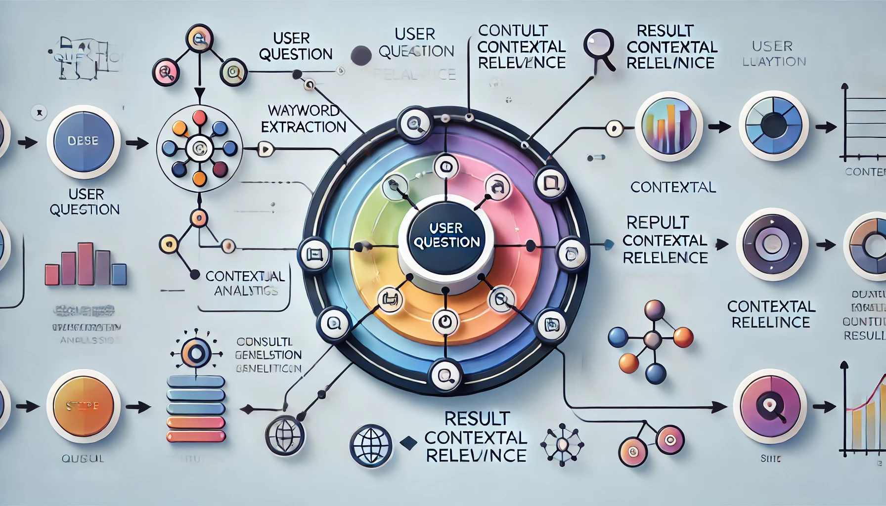
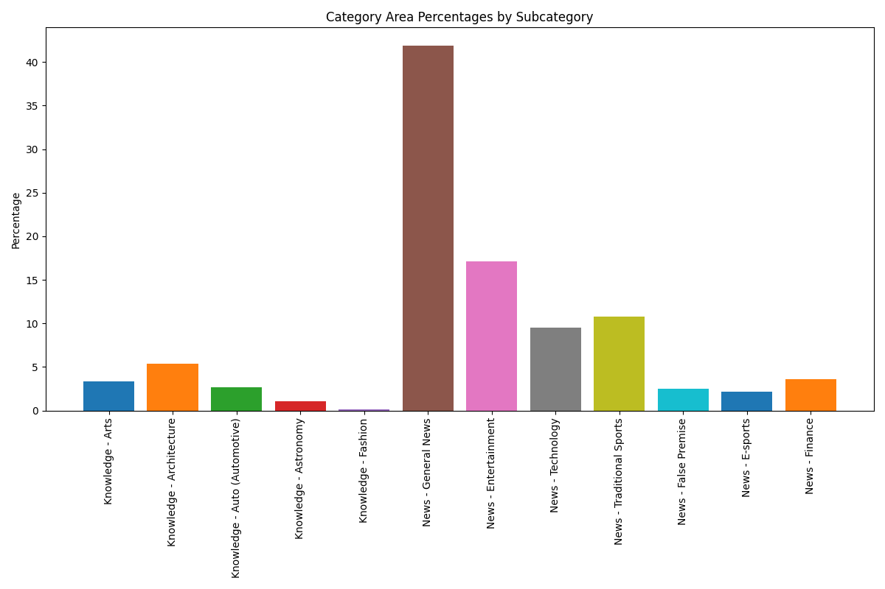
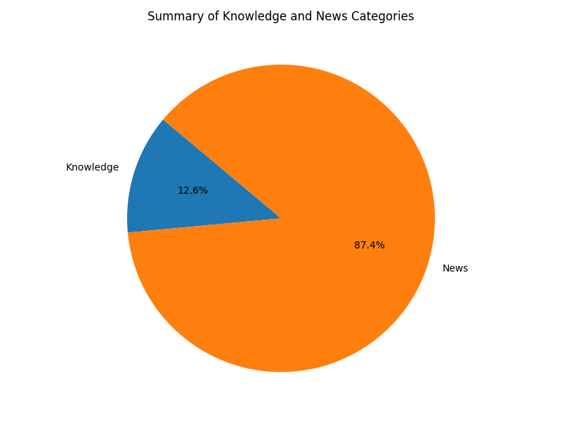

# 🏆 AI Search Providers Benchmark

## 📚 Introduction

The AI Search Wars Have Begun - ChatGPT Search, Andi Search, Gemini Grounding, and more. In this rapidly evolving digital landscape, AI-powered search engines are at the forefront of innovation, offering users enhanced search capabilities and personalized experiences. This benchmark aims to analyze, fetch, and prepare data from leading AI search providers currently available in the market. Our focus includes:

1. **[Datura (Meta - Bittensor Network, Subnet 22)](https://chi.datura.ai/)** - Visit Datura
2. **[You.com](https://you.com/)** - Visit You.com
3. **[OpenAI ChatGPT](https://openai.com/index/introducing-chatgpt-search/)** - Learn about ChatGPT Search
4. **[Perplexity](https://www.perplexity.ai/)** - Visit Perplexity
5. **[Google Gemini](https://gemini.google.com/app)** - Visit Google Gemini
6. **[Andi Search](https://andisearch.com/)** - Visit Andi Search
7. **[X Grok](https://x.com/i/grok)** - X Grok

Through this benchmark, we aim to provide insights into the capabilities and performance of these AI search engines, helping users and developers make informed decisions about which platforms best meet their needs.

## 📊 Provider Performance Comparison

Below is a table showcasing the results of each provider in various aspects of our scoring mechanism:

| Provider           | Summary Text Relevance | Link Content Relevance | Performance (s) | Embedding Similarity |
| ------------------ | ---------------------- | ---------------------- | --------------- | -------------------- |
| Andi Search        | 23.75%                 | 66.42%                 | 6.47s           | 21.47%               |
| You.com            | 43.84%                 | 65.07%                 | 1.69s           | 57.07%               |
| OpenAI ChatGPT     | 92.05%                 | 65.04%                 | 2.31s           | 73.15%               |
| Perplexity         | 94.71%                 | 63.85%                 | 5.61s           | 75.38%               |
| Google Gemini      | 0.00%                  | 0.00%                  | 0.00s           | 0.00%                |
| Grok 2             | 0.00%                  | 0.00%                  | 0.00s           | 0.00%                |
| Datura Nova 1.0    | 88.15%                 | 74.06%                 | 8.89s           | 73.04%               |
| Datura Orbit 1.0   | 92.95%                 | 76.00%                 | 18.92s          | 72.97%               |
| Datura Horizon 1.0 | 0.00%                  | 0.00%                  | 0.00s           | 0.00%                |

### 🏆 Top Model Analysis

| 📊 Top Model Per Search Summary                            | 🌐 Best Model Per Web Link Content Relevance                            |
| ---------------------------------------------------------- | ----------------------------------------------------------------------- |
|  |  |

<!-- <div style="display: flex; justify-content: space-between;">
    <div style="width: 48%; text-align: center;">
        <h4>📊 Top Model Per Search Summary</h4>
        
    </div>
    <div style="width: 48%; text-align: center;">
        <h4>🌐 Best Model Per Web Link Content Relevance</h4>
        
    </div>
</div> -->

## 🐦 Twitter Relevance Results

In this section, we present the results focusing on Summary and Twitter Content Relevance. Only Datura and X Grok are included in this analysis, as they have access to Twitter data. Other providers are excluded because they do not have the capability to provide Twitter-related insights.

Below is a table showcasing the results of each provider in terms of Summary and Twitter Content Relevance:

| Provider         | Summary Text Relevance | Link Content Relevance | Performance (s) | Embedding Similarity |
| ---------------- | ---------------------- | ---------------------- | --------------- | -------------------- |
| Grok 2           | 96.67%                 | 27.14%                 | 8.86s           | 77.92%               |
| Datura Nova 1.0  | 67.33%                 | 24.57%                 | 8.21s           | 69.34%               |
| Datura Orbit 1.0 | 78.33%                 | 49.57%                 | 26.04s          | 71.31%               |

### 📊 Top Models Chart

| 🥇 Top Models Per Twitter Content                          | 🔍 Best Model Embedding Similarity                                      |
| ---------------------------------------------------------- | ----------------------------------------------------------------------- |
|  |  |

<!-- <div style="display: flex; justify-content: space-between;">
    <div style="width: 48%; text-align: center;">
        <h4>🥇 op Models Per Twitter Content</h4>
        
    </div>
    <div style="width: 48%; text-align: center;">
        <h4>🔍 Best Model Embedding Similarity</h4>
        
    </div>
</div> -->

## 📈 Scoring Mechanism

To evaluate the performance and relevance of AI search providers, we have developed a comprehensive scoring mechanism. This mechanism assesses the quality of responses based on several key factors:

1. **Summary Text Relevance**:

   - We utilize a language model (LLM) to evaluate the relevance of the summary text provided by each AI search provider in relation to the question asked.
   - In our initial tests, we employed GPT-4o to assess the relevance between the summary text and the questions.

2. **Link Title and Description Relevance**:

   - Each link's title and description returned by the provider are checked for contextual relevance to the question.
   - This involves analyzing whether the content of the links is pertinent to the query, ensuring that the search results are not only accurate but also useful.

3. **Performance**:

   - This metric evaluates the response time of each provider, measured in milliseconds.
   - Faster response times contribute positively to the overall score, as they enhance the user experience by providing timely information.

4. **Embedding Similarity**:
   - We calculate the similarity between the embeddings of the question and the returned results.
   - This involves using vector representations to measure how closely related the question is to the content of the results, providing an additional layer of relevance assessment.

By incorporating these factors, our scoring mechanism provides a holistic view of each provider's capabilities, helping users and developers make informed decisions based on both qualitative and quantitative data.



## ⚡ Fastest and Most Affordable Models

In this section, we evaluate the AI search providers based on their speed and cost-effectiveness. The following chart illustrates the latency of each model, providing insights into which models offer the fastest response times at the most affordable rates.


### 🧰 Scraper Scripts

All scraper scripts are located in the `./scraper` directory. These scripts are designed to collect data from each provider's repository. We execute these processes on our local machines, and the collected data is stored in the `results` directory.

### 🛠️ Methodology

The Talc AI team creates datasets by:

1. Scraping various trustworthy sources for interesting facts and lessons.
2. Creating sets of Q&A to represent those facts.
3. Adjusting the tone, style, and distribution of queries to best match production users.

They categorize their dataset into four major categories:

1. **Simple**: Basic questions requiring minimal analysis.
2. **Complex**: Questions needing synthesis across multiple sources.
3. **Hallucination Inducing**: Questions with false premises to test AI's factual accuracy.
4. **News**: Questions with answers that change due to recent developments.

This approach ensures that the dataset is both comprehensive and adaptable to real-world scenarios, making it an excellent resource for benchmarking AI search providers.

## 🔍 Data Fetch Process

In our project, we aim to gather data from various AI search providers. However, many of these providers do not offer APIs for direct data retrieval. To address this, we have developed simple scraper scripts to extract data from each provider for our dataset.

## 📊 Dataset

In our first test, we decided to utilize a dataset from the [Talc AI SearchBench repository](https://github.com/Talc-AI/search-bench). We extend our gratitude to the Talc AI team for their valuable contribution.

The SearchBench repository addresses common issues with traditional benchmarks by focusing on practical, everyday use cases rather than theoretical limits. It emphasizes realistic user queries and the incorporation of new knowledge over time, ensuring that AI products remain relevant and useful.

### 📂 Dataset Source

Our dataset is sourced from the Talc AI Search Bench repository and is stored in the `dataset/data.jsonl` file.

To better illustrate the structure of responses in your `README.md`, you can provide a more detailed example of the JSON structure. Here's how you can update the `README.md` to include a more comprehensive example:

Filling in more realistic values in the example can indeed make it clearer and more informative for users. Here's an updated version of the example with more detailed and realistic values:

| 📈 Areas                                                            | 📉 Categories                                                                 |
| ------------------------------------------------------------------- | ----------------------------------------------------------------------------- |
|  |  |

By using this approach, we ensure that we can gather the necessary data for our analysis, even in the absence of direct API access from the providers.

### 📐 Structure of Responses

The structure of the responses is as follows:

1. **Question**: This is the query we send to the AI search provider.
2. **Result**: This field contains the summary text returned by the provider.
3. **Search Results**: This includes web links, titles, and descriptions returned by the providers.
4. **Response Time**: The time taken to receive the response from the provider, measured in milliseconds.

#### 📝 Example Response

```json
{
  "id": "c0683ac6-baee-4e2a-9290-8b734b777301",
  "question": "What did safety reviews conclude about the danger of experiments at the Large Hadron Collider?",
  "result": "Safety reviews have consistently concluded that the experiments at the Large Hadron Collider pose no significant risk to the public or the environment.",
  "search_results": [
    {
      "title": "CERN's Safety Assessment",
      "url": "https://home.cern/science/experiments/safety",
      "description": "An overview of the safety measures and assessments conducted by CERN regarding the LHC experiments."
    },
    {
      "title": "LHC Safety: Public Concerns Addressed",
      "url": "https://www.scientificamerican.com/article/lhc-safety-public-concerns/",
      "description": "This article addresses public concerns about the safety of the LHC and explains why these fears are unfounded."
    }
  ],
  "response_time": 10
}
```

## 🚀 Future Directions

We are committed to regularly updating this benchmark to reflect the latest advancements in AI search technologies. Your feedback is invaluable to us, as we strive to make this benchmark as practical and user-focused as possible.

If you encounter any inaccuracies or areas for improvement, please share your thoughts with us. We are eager to enhance the benchmark based on your insights.

For inquiries, suggestions, or contributions, feel free to contact
